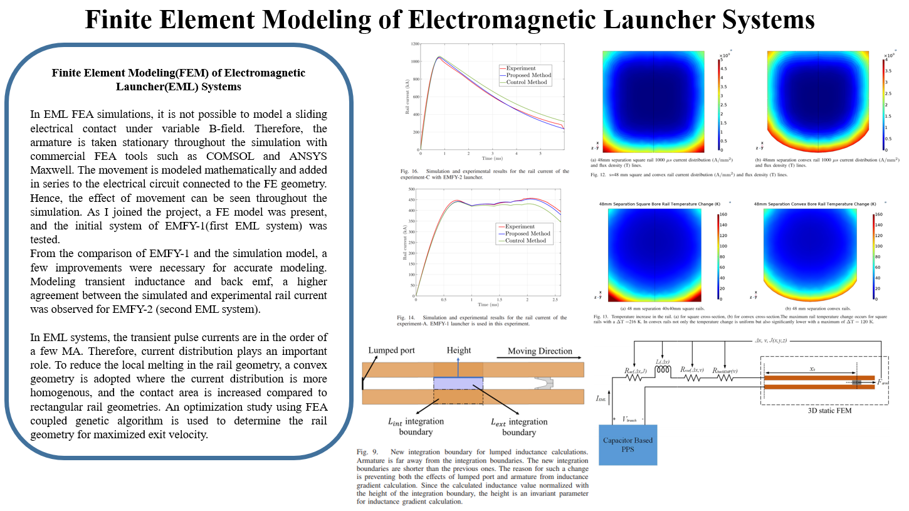

# Related Papers
[A Comparison of Velocity Skin Effect Modeling With 2-D Transient and 3-D Quasi-Transient Finite Element Methods](https://ieeexplore.ieee.org/document/9387772)

[A Hybrid Simulation Model for Electromagnetic Launchers Including the Transient Inductance and Electromotive Force](https://ieeexplore.ieee.org/document/9179020)

[Optimization of a Convex Rail Design for Electromagnetic Launchers](https://ieeexplore.ieee.org/document/9104009)

[Utilization and Optimization of Superconducting Coil Parameters in Electromagnetic Launcher Systems](https://ieeexplore.ieee.org/document/9009612)

[Simulations and Experiments of EMFY-1 Electromagnetic Launcher](https://ieeexplore.ieee.org/document/8727719)

