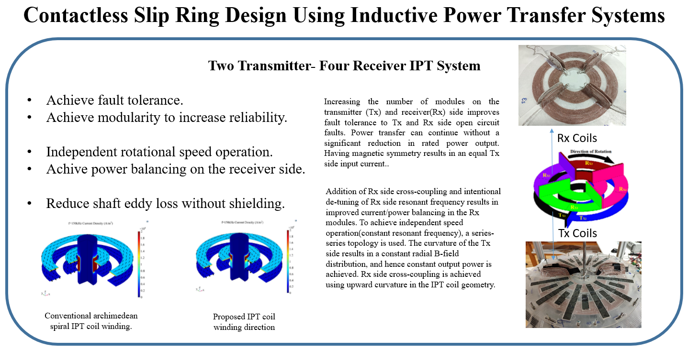
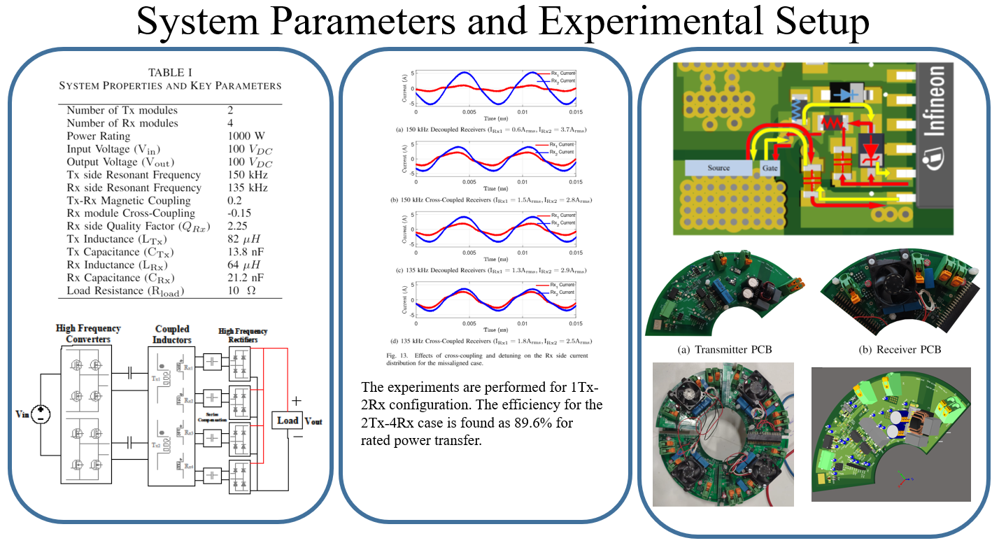
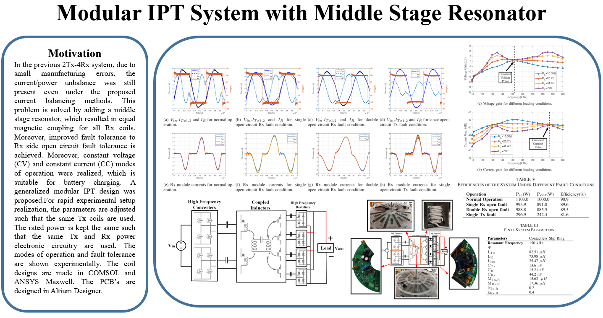

# Related Papers
[Balancing of Common DC-Bus Parallel ConnectedModular Inductive Power Transfer Systems](https://www.techrxiv.org/articles/preprint/Balancing_of_Common_DC-Bus_Parallel_Connected_Modular_Inductive_Power_Transfer_Systems/13013882)
[Fault Tolerant Modular Inductive Power TransferSystem Design Using Resonator Coil](https://www.techrxiv.org/articles/preprint/Fault_Tolerant_Modular_Inductive_Power_Transfer_System_Design_Using_Resonator_Coil/14370617)

